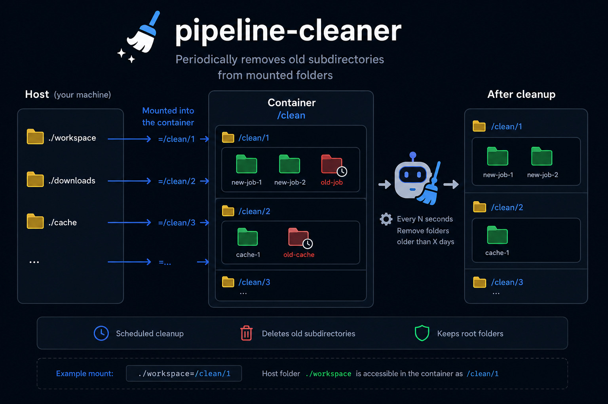

# pipeline-cleaner



Tiny Docker service that periodically deletes old directories from mounted folders.


## Description

Other services create temporary working directories.

`pipeline-cleaner` scans `/clean/*`, finds old direct subdirectories by age, and removes them on a schedule.

Mount one or more folders into `/clean`:

```yaml
volumes:
  - ./workspace:/clean/1
  - ./other-workspace:/clean/2
````

Required environment:

```env
DIR_MAX_AGE_DAYS=3
```

Optional environment:

```env
CLEANUP_INTERVAL_SECONDS=1800
PRINT_DELETED=1
```

`pipeline-cleaner` may delete:

```text
/clean/1/old-job
/clean/2/old-cache
```

It does not delete mounted root folders themselves:

```text
/clean/1
/clean/2
```

## Release

Git tag:

```bash
git tag 1.0.0
git push origin 1.0.0
```

Published images:

```text
ghcr.io/tupinumboor/pipeline-cleaner:1.0.0
ghcr.io/tupinumboor/pipeline-cleaner:latest
```
